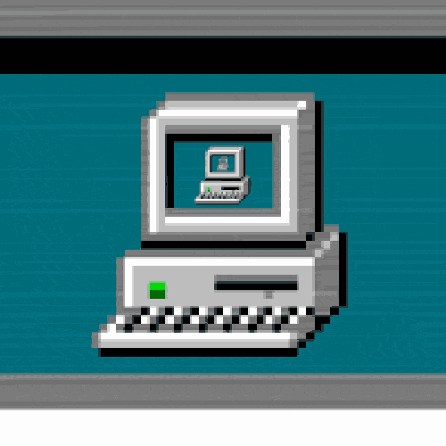

  

    

      <h1>Hello World 👋</h1>
      

        Me chamo Ester Reis, tenho 19 anos e estou cursando Sistemas para Internet no IFPE.
      

      <h2>🤳 Redes Sociais</h2>
      

        
        
      

      <h2>📜 Certificados</h2>
      <ul>
        <li>Redes de Computadores</li>
        <li>Programador Web Java</li>
        <li>Fundamentos AWS</li>
      </ul>
      <h2>🏆 Conquistas</h2>
      <ul style="list-style-type: none; padding: 0;">
        <li>1º Lugar no torneio de xadrez da GRE Metro Norte. - 2020</li>
      </ul>
      
Obrigada pela visita! 😊

    

    <!-- Coluna Direita (Elementos Visuais) -->
    

      <!-- GIF Superior -->
      

        
      

      <!-- TryHackMe Badge Inferior -->
      

        
      

    

  

